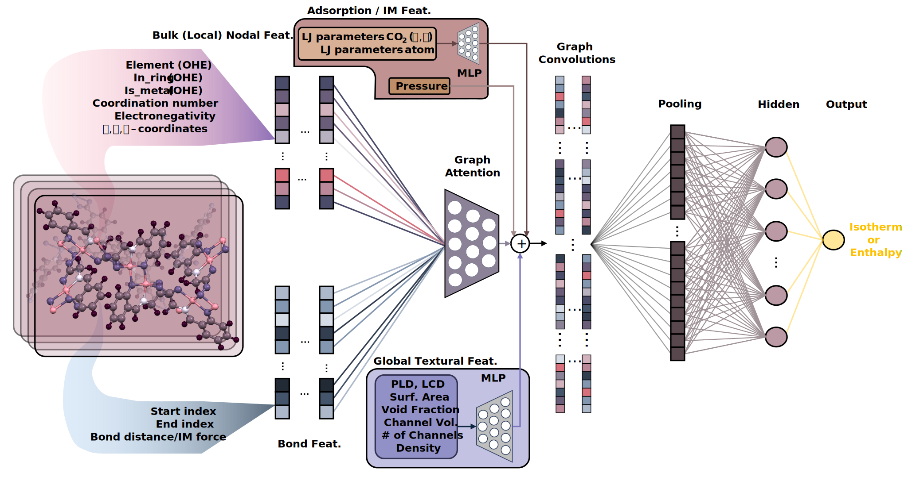
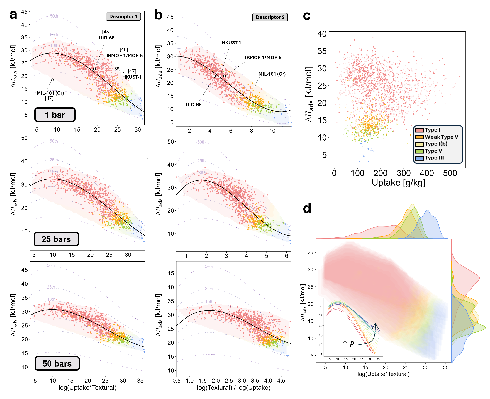

# IsothermNet
Code release for [Unified physio-thermodynamic descriptors *via* learned CO<sub>2</sub> adsorption properties in metal-organic frameworks](link) (published in ___*somewhere*__)



IsothermNet is a cascading deep learning model that leverages graph attention (GAT) and crystal graph convolutional neural networks (CGCNN) to predict uptake and heat of adsorption ($\Delta$ H<sub>ads</sub>) in a high-throughput manner. The GNN-based model is applicable over 0-50 bars and is trained over 19 distinct pressure points, thereby enabling high-resolution, full isotherm reconstruction with higher prediction accuracy than any previous state-of-the-art models. Ultimately, IsothermNet can serve as a surrogate model for computationally-expensive atomistic simulations (e.g., Grand Canonical Monte Carlo [GCMC]), which often require in-depth domain knowledge to perform. Using these learned adsorption properties, we further formulated two sets of holistic descriptors unifying textural properties, isotherm shape, uptake, and heat of adsorption: the first is more physically-interpretable and the second follows a more analytical/mathematical form that excels at differentiating the five isotherm classes. When used cooperatively with IsothermNet, these descriptors can enable efficient material screening and accelerate the discovery of high-performance MOFs for CO<sub>2</sub> capture.

To summarize, we offer two methods for uptake and $\Delta$ H<sub>ads</sub> prediction: (1) high accuracy estimations utilizing the IsothermNet model or (2) very fast, large-scale predictions using easily-accessible geometric (textural) information *via* universal physical and analytical descriptors. Thus, for the first time, using only easily-accessible crystal information, future researchers can: 
- Expedite $\Delta$ H<sub>ads</sub> characterization for new, experimentally-synthesized MOFs
- Employ high-throughput uptake/$\Delta$ H<sub>ads</sub> prediction for theoretical work (wherein sample sizes easily exceed 10<sup>6</sup>)
- Accelerate isotherm shape determination by bypassing full isotherm (or extraneous uptake and $\Delta$ H<sub>ads</sub>) calculations 

## Installation

The required Python packages can be found in the Dockerfile. 

## Data

The partial dataset can be found in ```./data/```, and the full dataset can be found in the [Zenodo repository](link) under ```full_dataset.zip```. The compressed file contains: 
- **```X_dataset_electro_xyz_bond_struc.pth```**: post-processed (featurized with ```dataProcessing.py```) structural information
- **```texturalProperties_vol.xlsx```**: textural properties
- **```y_dataset19.pth```**: uptake data in g/g
- **```H_dataset.pth```**: heat of adsorption ($\Delta$ H<sub>ads</sub>) data in kJ/mol

All MOF samples are sourced from the Quantum MOF (QMOF) database (of the 20,375 MOFs, only 5,394 are CO<sub>2</sub> adsorption-capable based on the kinetic diameter of a CO<sub>2</sub> molecule). The crystallographic (.cif) files for each MOF structure can be obtained [here](https://github.com/Andrew-S-Rosen/QMOF/) [1,2].

The input data can be downloaded here (from Zenodo):
```
wget https://zenodo.org/api/files/273e913a-e11d-46e1-96dc-a28497c49d36/data.tar.gz
```

## Training IsothermNet and Predicting Isotherms

1. From ```configs.py``` file, load checkpoint, hyperparameter set, and featurized structural inputs (if they exist). 
   
   ```
   # Loading checkpoints/data
   load_checkpoint = False        # if False: don't load pre-existing checkpoint, else load best model
   load_hp = True                 # if True: load optimal hyperparameter set, else refine with optuna
   run_dataProcess = False        # if False: don't run featurization on structure, else load featurized set
   ```
2. Run ```train_isothermnet.py``` to train the model.
3. Load the best model (set ```load_checkpoint = True``` and ```num_epoch = 0```) and predict on an unseen test set.

Ultimately, IsothermNet can be used to construct full uptake and heat of adsorption ($\Delta$ H<sub>ads</sub>) isotherms.


An example of a fully-trained model for the 50 bars case can be found in the [Zenodo repository](link) under ```trained_model_50_bars.zip```. The compressed file contains the checkpoints, best model, and results. The trained model can be downloaded below:
```
wget https://zenodo.org/api/files/273e913a-e11d-46e1-96dc-a28497c49d36/data.tar.gz
```

## Using the Descriptors

From the learned adsorption properties, we formulated two sets of universal analytical (A1/A2) and physical (P1/P2) descriptors that effectively bridge MOF structural/surface properties, uptake, and heat of adsorption ($\Delta$ H<sub>ads</sub>) together. The following descriptors are optimized for different pressure regimes and can be summarized as follows: 
- **Analytical descriptors**: ```[A1]``` for high-pressure regime, ```[A2]``` for low-pressure regime (< 10 bars)
- **Physical descriptors**: ```[P1]``` for high-pressure regime, ```[A2]``` for low-pressure regime (< 15 bars)



To use the descriptors, please refer to ```./descriptors/``` to find the Jupyter demos, which include the parameters for different pressures. The full set of parameters for all descriptors can be found in the [paper](link). 

## Citing

If you found this work useful, please consider citing: 

[something]

## Acknowledgements

This work used the Engaging OnDemand clusters at MIT Office of Research Computing and Data (ORCD). This work additionally used Bridges-2 at Pittsburgh Supercomputing Center (PSC) through allocation MCH230021 from the Advanced Cyberinfrastructure Coordination Ecosystem: Services & Support (ACCESS) program, which is supported by National Science Foundation Grants No. 2138259, 2138286, 2138307, 2137603, and 2138296. This work is also supported by the National Science Foundation Graduate Research Fellowship under Grant No. 2141064. 

## References

[1] A.S. Rosen, S.M. Iyer, D. Ray, Z. Yao, A. Aspuru-Guzik, L. Gagliardi, J.M. Notestein, R.Q. Snurr. "Machine Learning the Quantum-Chemical Properties of Metal–Organic Frameworks for Accelerated Materials Discovery", Matter, 4, 1578-1597 (2021). DOI: 10.1016/j.matt.2021.02.015.  
[2] A.S. Rosen, V. Fung, P. Huck, C.T. O'Donnell, M.K. Horton, D.G. Truhlar, K.A. Persson, J.M. Notestein, R.Q. Snurr. "High-Throughput Predictions of Metal–Organic Framework Electronic Properties: Theoretical Challenges, Graph Neural Networks, and Data Exploration," npj Comput. Mat., 8, 112 (2022). DOI: 10.1038/s41524-022-00796-6.
